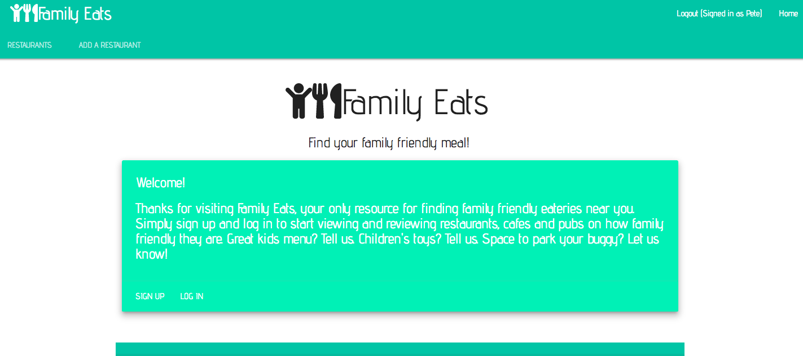
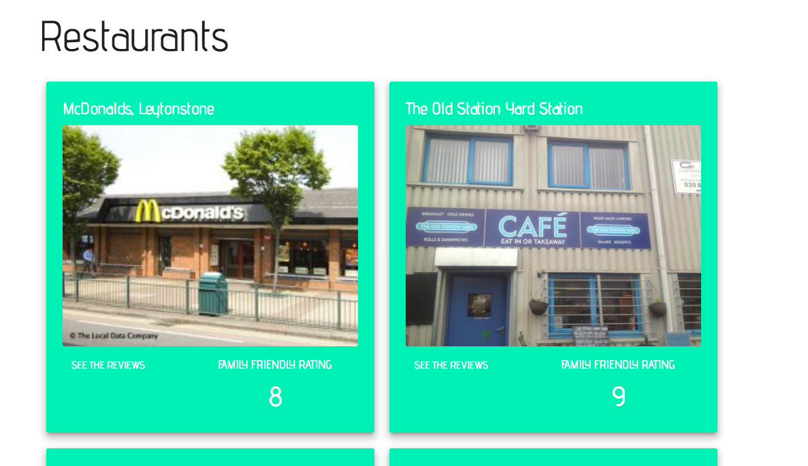
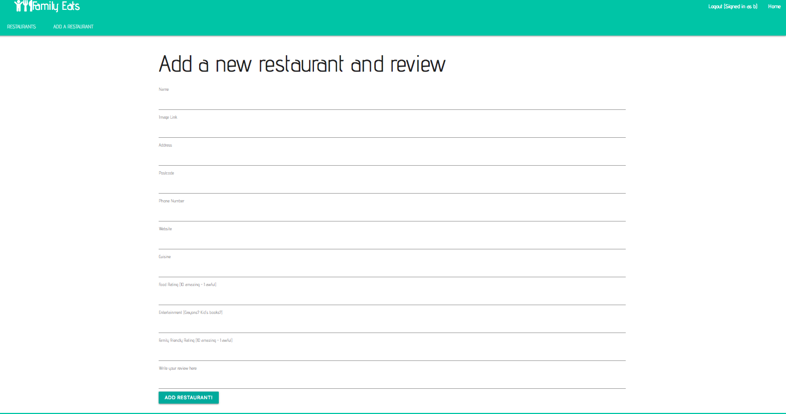
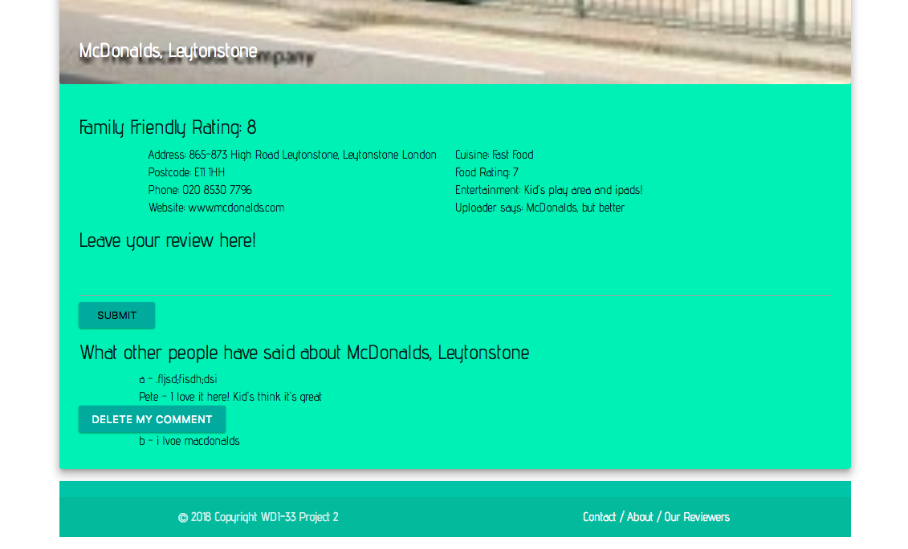
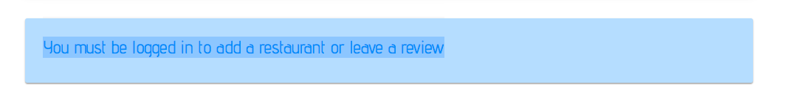

# Project 4: Family Friendly Eating

### Overview
Family Friendly Eating allows users to add and review eateries based on their family friendliness. The challenge was to build a simple full stack app with RESTful routes after a week of learning Express.

### Project Brief

##### Technical Requirements

* **Have at _least_ 2 models** – one representing a user and one that represents the main resource of your app.
* **Incude relationships** - embedded or referenced. Make sure you take the time to consider the best approach before building out your models.
* **The app should include authentication** - with encrypted passwords & an authorization flow.
* **Have complete RESTful routes** for at least one of your resources with all CRUD actions.
* **Include wireframes** - that you designed before building the app.
* Have **semantically clean HTML** - you make sure you write HTML that makes structural sense rather than thinking about how it might look, which is the job of CSS.
* **Be deployed online** and accessible to the public.

##### MVP

* Has a User model and user authentication.
* Has models for Restaurants and Reviews.
* Allow users to add, edit and delete restaurants and reviews.
* Users can only delete their own reviews or restaurants added.
* Is styled with Bulma, but doesn't look like Bulma.

### [Heroku](https://family-eats.herokuapp.com/)

### [GitHub Repo](https://github.com/Petemab/family_meal_app)

 ---

### Technologies:

For this project I have used the following technologies:

* Express
* Node.js
* Mongoose
* Mongodb
* EJS
* JavaScript
* SCSS
* HTML5
* Materialize CSS Framework
* bcrypt

---

### Screenshots
Some Screen shots

Home Page:

Index Page:

New Page:

Show Page:

Error Message:

---

### Challenges and Problems

* Perhaps the biggest challenge of this project was getting to grips with the basics of handling a front and back end after just a week of learning.

* I found ejs a bit tricky to work with but more or less got to grips with it after a few days.

* I perhaps didn't plan this as well as I could have and therefore got blocked on several occasions when I could have been adding more features.

* While Materialize was fun to work with, my styling perhaps left something to be desired, largely due to time restraints.

---

### Wins

* I met the brief on time and was able to add things like comments and error messages.

* The app worked quite well and although simple actually served a purpose and gave me something to build on.

* It was fun to work with a different CSS framework, in this case Materialize and demonstrate I could learn it quickly to a decent level.

---

### Future Features

Features I would have liked to include:

* It would be fun to rebuild this app using a more interesting framework, like AngularJS or React.

* Google maps would really bring the app to life.

* I would probably want to restyle completely given the chance.
